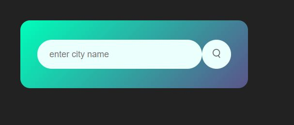
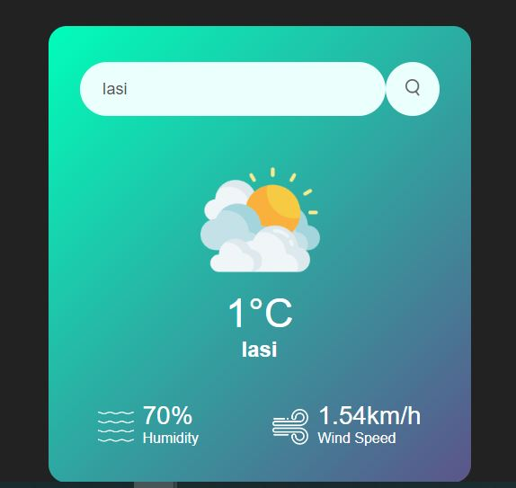

# THE-WEATHER-HTML-CSS-JS
Weather-app-using-html-css-and-javascript

This is a simple weather app using HTML, CSS and JS. API key is required for this weather app to work.
I used this key from the official OpenWeatherMap website for free. After I registered using the email, the API key (APPID) was sent in a confirmation email.

 ### Source:
 * [API](https://darksky.net/dev)
 * [FONTS](https://fonts.google.com/);
